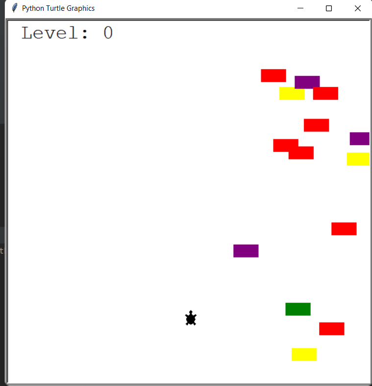

# Turtle Crossing Game

Game: Turtle crossing a road with moving cars
Behind the scenes: using Object Oriented Programming (OOP) for the different parts of the project:
- Cars moving
- Player moving
- Scoreboard

## How to play

- Hit run 
  - The turtle starts on the bottom side of the road 
  - Cars will start appearing from right side, moving leftwards
- Make the turtle cross the road by hitting the Up arrow on your keyboard
  - When it hits the upper side of the road, the level will increase by one and the position with be reset 
  - If the turtle hits a car, the game will be over

